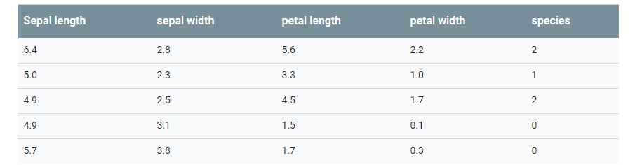

# Getting Started With Machine Learning

So, this section explains us to use Machine Learning to classify (categorize) Iris flowers by species. 
Well, in the programing cummunity we often refer 'Iris Flower Classification' problem as the 'Hello World' of Machine Learning.
This document will help you to dive deeply into the TensorFlow code to do exactly that, explaining ML fundamentals along the way.

If the following list describes you, then you are in the right place:

- You know little to nothing about machine learning.
- You want to learn Tensorflow
- You can code (atleast a little) in Python.

## The Iris Classification Problem

The problem is to write a program which can tell classify the given Iris plant to it's respective species. 
But our ambitions are more modest--we're going to classify Iris flowers based solely on the length and width of their *sepals* and *petals*. For fact, the Iris family has about 300 species but right now we would deal with three of them. 

- Iris Setosa
- Iris Virginica
- Iris Versicolor

Okay, we are clear with the Problem Statement, so now you don't know anythin about ML and decide to write a program which does that and you started writing down all the **variables** which make a flower, flower. But ta-da there are many many many variables that contribute in making of a flower which unfortunately you can not take into account. To ease that, we use **Machine Learning**.
The difference is that, now we don't tell everything (like we used to do in *classical programs*) to the program. Infact, we don't tell anything to the program about the flower. Infact we don't tell it anything about the flower. We give it some related data of Iris Flower and train it on the basis of it and later we feed it with some input and ask the program to tell us that is it the flower we are looking for.
For a start, we already have a well-labeled dataset of 120 Iris flower of these three different species with the sepal and petal measurements. The dataset is avaiable already in the repo, and you could easily find over the internet.

Before getting our hands dirty, let's get introduced with some common terms:

